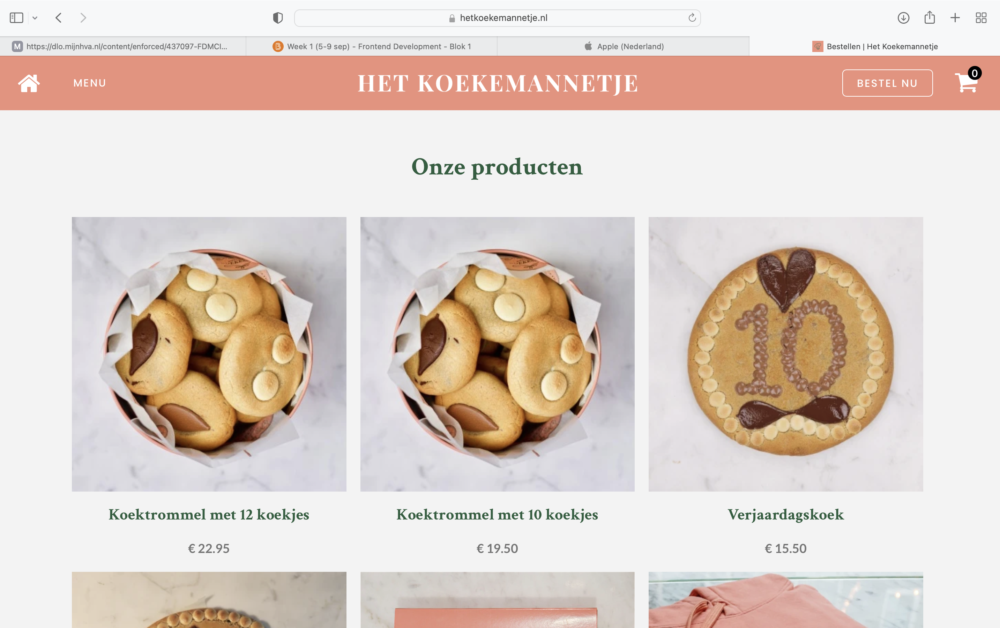
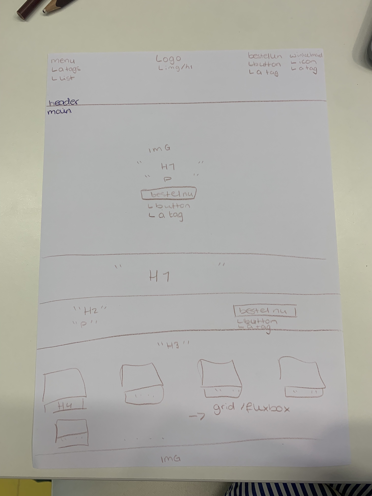
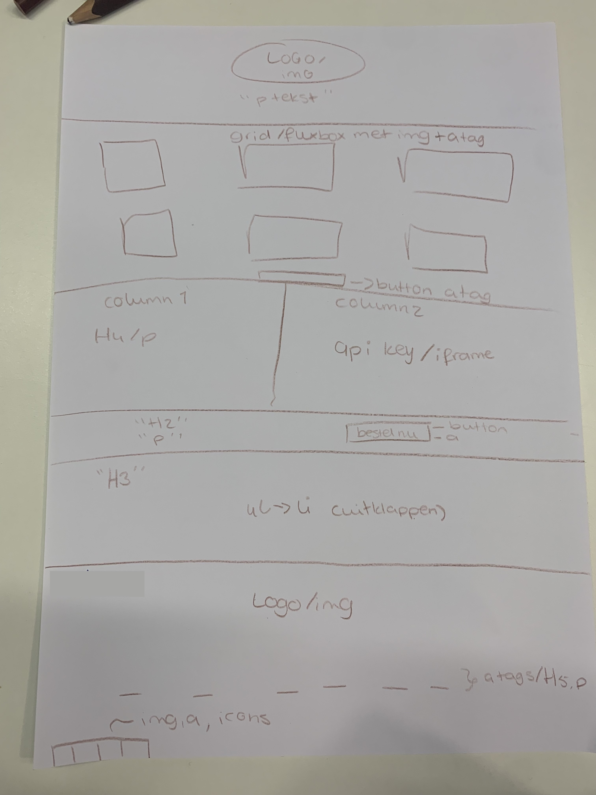
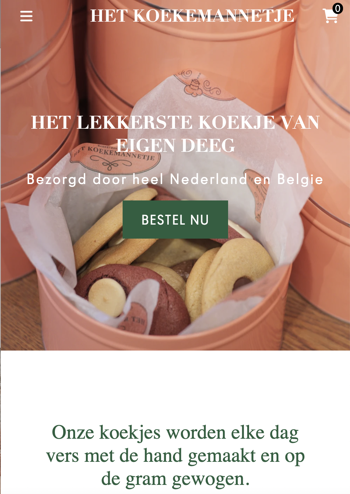
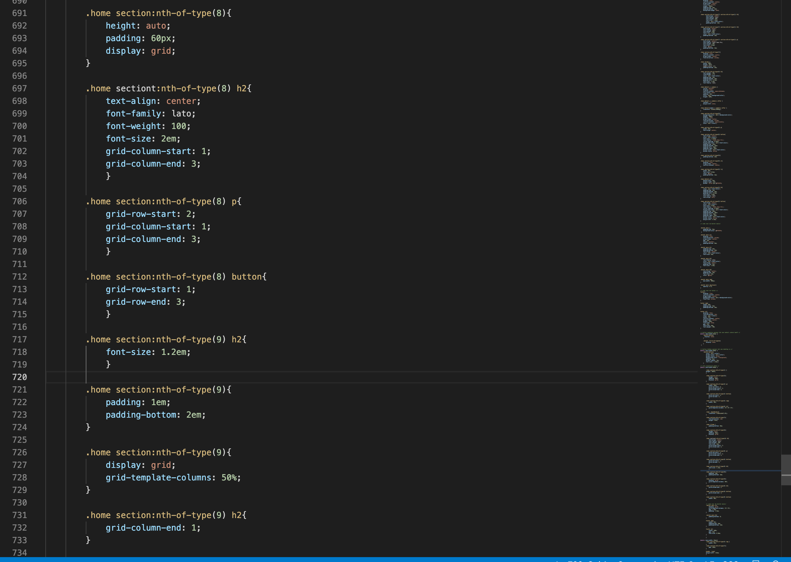
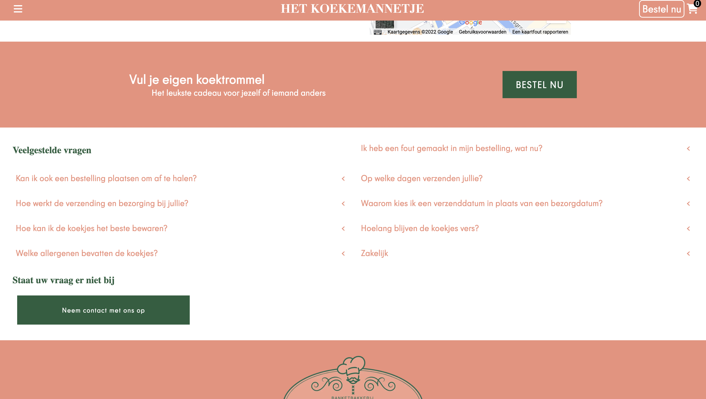

# Procesverslag
Markdown is een simpele manier om HTML te schrijven.  
Markdown cheat cheet: [Hulp bij het schrijven van Markdown](https://github.com/adam-p/markdown-here/wiki/Markdown-Cheatsheet).

Nb. De standaardstructuur en de spartaanse opmaak van de README.md zijn helemaal prima. Het gaat om de inhoud van je procesverslag. Besteedt de tijd voor pracht en praal aan je website.

Nb. Door *open* toe te voegen aan een *details* element kun je deze standaard open zetten. Fijn om dat steeds voor de relevante stuk(ken) te doen.

## Jij

  
uitwerken voor kick-off werkgroep

  ### Auteur:
  Luca Oudejans

  #### Je startniveau:
  Blauwe piste

  #### Je focus:
  Surface plane + responsive
 

## Je website

  
uitwerken voor kick-off werkgroep

  ### Je opdracht:
  https://www.hetkoekemannetje.nl

  #### Screenshot(s) van de eerste pagina (small screen): 
  Homepage  
  

  #### Screenshot(s) van de tweede pagina (small screen):
  Bestel pagina
  
 

## Toegankelijkheidstest 1/2 (week 1)

  
uitwerken na test in 1e werkgroep

  ### Bevindingen
  Mijn bevindingen van slecht zicht:
    - Het rechter zicht werd geblokkeerd
    - Mijn hoofd moet ik iets draaien om de winkel knop rechts boven te kunnen zien
    - 99% van de site is goed te zien
    - De site is goed te gebruiken met slecht zicht

  #### Screenreader
  De voice over op mijn mac heb ik gebruikt als screen reader. 
  Toen ik het aan het gebruiken was, kwam ik er gelijk al achter dat niet alles werd opgelezen, bijvoorbeeld de buttons (winkelwagen button). Naast dat hij niet alles oplas, werden er ook onnodige dingen opgelezen (link, 0). 

  De screenreader kan je bevorderen door een betere semantische code. De onnodige teksten eruit halen en headings, sections, paragraven, lists etc gebruiken.

  #### Muis en Toetsenbord 
  Toen ik de website probeerde te gebruiken met alleen tab, shift, enter en pijltjes toetsen kwam ik er al snel achter dat dit bijna niet ging. Van boven naar beneden ging goed. Echter lukte het niet om de header te gebruiken (menu, bestellen, winkelwagen). 
  Toen ik naar de volgende pagina kwam, lukte het wel om de header te gebruiken. 

  Zorgen dat de header te gebruiken is op de homepage. 

  #### Motoriek (shocks, elastiekjes)
  Ik heb elastiekjes gebruikt om mijn wijs en middelvinger aan elkaar vast te 'plakken'. Ik kreeg gelijk door dat het moeilijker met scrollen is, dus het wel belangrijk is dat je ook knoppen daarvoor kan gebruiken. Ook moest ik knoppen aanklikken met een andere vinger. Dit is meer iets want onwennig is. Voorderest is de website wel gewoon goed te gebruiken. 

  Ook heb ik shocks gebruikt. Ik voelde dit vooral in mijn onderarm. Typen werd lastiger maar het lukte wel nog om te scrollen en te klikken. 

  #### Visueel (brillen, contrast, kleurenblind, dark/light). 
  Voor de visuele oefening heb ik mijn laptop op blur gezet. Hierin werd alles wazig en werd het lastiger om teksten te lezen en afbeeldingen te zien.

  Niet te kleine teksten/foto's gebruiken op de website.

## Breakdownschets (week 1)

  
uitwerken na afloop 2e werkgroep

  ### de hele pagina: 
  

  ### dynamisch deel (bijv menu): 
  

  ### wellicht nog een dynamisch deel (bijv filter): 
  

## Mini-symposium (week 1)
  Vandaag heb de mini-symposium bijgewoond. De eerste gastcollege werd gegeven door manuel, hij vertelde over toegankelijkheid.
  Wat mij bij is gebleven van het college:
    - je kan het goed zelf testen door middel van de tab en enter toetsen
    - de alt teksten zijn erg belangrijk
    - je kan dingen benoemen met titels, aria etc.
    - geef dingen een heading voor shortcuts
    - voeg shortcuts toe bij lists bijv.
    - test de site met tab en screencast
  Het tweede gastcollege werd gegeven door eric. Dit college vond ik vooral goed omdat het zo heel echt werd. De voorbeelden die hij gaf, gaven ineens een heel duidelijk beeld bij het hoorcollege.

## Voortgang 1 (week 2)

  
uitwerken voor 1e voortgang

  ### Stand van zaken
  De eerste week ging goed. Wel moest ik weer wat dingen naar boven halen mbt semantisch correcte code en hoe je wat doet.
  Waar ik vooral moeite mee had, was met iconen en fonts toevoegen.

  ### Agenda voor meeting
  samen met je groepje opstellen

  | student 1      | student 2          | student 3    | student 4        |
  | ---            | ---                | ---          | ---              |
  | dit bespreken  | en dit             | en ik dit    | en dan ik dat    |
  | en dat ook nog | dit als er tijd is | nog een punt | dit wil ik zeker |
  | ...            | ...                | ...          | ...              |

  ### Verslag van meeting
  hier na afloop snel de uitkomsten van de meeting vastleggen

  - flexbox gebruiken zodat het makkelijker wordt
  - icons gebruiken voor de winkelwagen en menu
  - fonts en icons linken + in de map doen

## Voortgang 2 (week 3)

  
uitwerken voor 2e voortgang

  ### Stand van zaken
  In week 2 had ik vooral vragen over waarom sommige dingen niet goed waren gecentreerd. Ik maakte fouten omdat ik 
  een display flex zette op de image ipv de container. Ook had ik vragen over mijn navigatie dat van kleur verandert 
  wanneer deze omlaag gaat. Hiervoor heb ik een codepen gekregen. 

  ### Agenda voor meeting
  samen met je groepje opstellen

  | student 1      | student 2          | student 3    | student 4        |
  | ---            | ---                | ---          | ---              |
  | dit bespreken  | en dit             | en ik dit    | en dan ik dat    |
  | en dat ook nog | dit als er tijd is | nog een punt | dit wil ik zeker |
  | ...            | ...                | ...          | ...              |

  ### Verslag van meeting

  - container stylen
  - js gebruiken voor header
  - js gebruiken voor menu
  - een summary maken

## Toegankelijkheidstest 2/2 (week 4)

  
uitwerken na test in 8e werkgroep

  ### Bevindingen
  Ik kwam erachter dat mijn site redelijk toegankelijk is. Wanneer ik tab begint het ook echt bij de navigatie en 
  kan ik door mijn menu heen tabben en zo door mijn hele navigatie. Wel kwam ik erachter dat de tab de h1,2 etc. overslaat.
  Ook heb ik geen shortcuts (aria).

  #### Screenreader
  Tijdens dat ik mijn screenreader gebruikte kwam ik erachter dat de winkelwagen icon aangegeven werd met '?', dit kan 
  verbeterd worden met een aria label. 

  #### Muis en Toetsenbord 
  Ik kon goed navigeren met enter, tab en shift. Dit was top. Ondanks de beperking, lukte het alsnog goed om de site te gebruiken.

  #### Visueel (brillen, contrast, kleurenblind, dark/light)
  Wanneer het beeld zwart/wit werd kon ik alles goed gebruiken. Omdat het contrast qua kleuren best hoog was, viel niks weg en kon ik alles nog goed gebruiken. 
  Toen ik eenmaal blur gebruikte kon ik nog steeds alles goed gebruiken alleen de plaatjes kon ik niet meer helemaal goed zien. Dit was jammer maar niet cruciaal. 

## Voortgang 3 (week 4)

  
uitwerken voor 3e voortgang

  ### Stand van zaken
  Ik had nogal moeite met dingen responsive maken. Dit stond centraal deze week. 

  ### Agenda voor meeting
  samen met je groepje opstellen

  | student 1      | student 2          | student 3    | student 4        |
  | ---            | ---                | ---          | ---              |
  | dit bespreken  | en dit             | en ik dit    | en dan ik dat    |
  | en dat ook nog | dit als er tijd is | nog een punt | dit wil ik zeker |
  | ...            | ...                | ...          | ...              |

  ### Verslag van meeting

  - mediaquery's gebruiken
  - mediaquery's onderaan de css plaatsen
  - css variabelen gebruiken

## Eindgesprek (week 5)

  
uitwerken voor eindgesprek

  ### Je uitkomst - karakteristiek screenshots:
  

  ### Dit ging goed/Heb ik geleerd: 
  Het leren van zo weinig mogelijk classes en de sections etc. goed benoemen in de css.

  

  ### Dit was lastig/Is niet gelukt:
  De site mooi responsive maken was meer werk en lastiger dan verwacht.
  Uiteindelijk is het gelukt maar ik heb er erg veel tijd aan besteed.

  

## Bronnenlijst

bronnen staan in de code zelf :)

